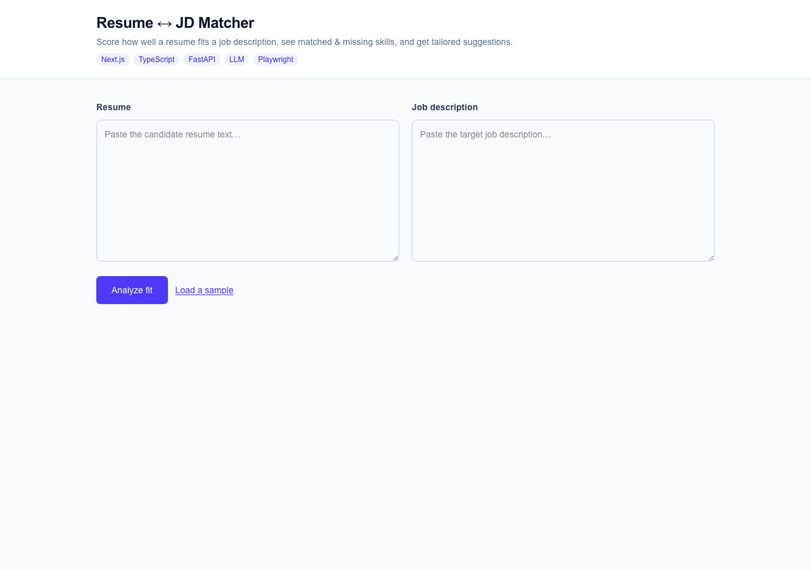
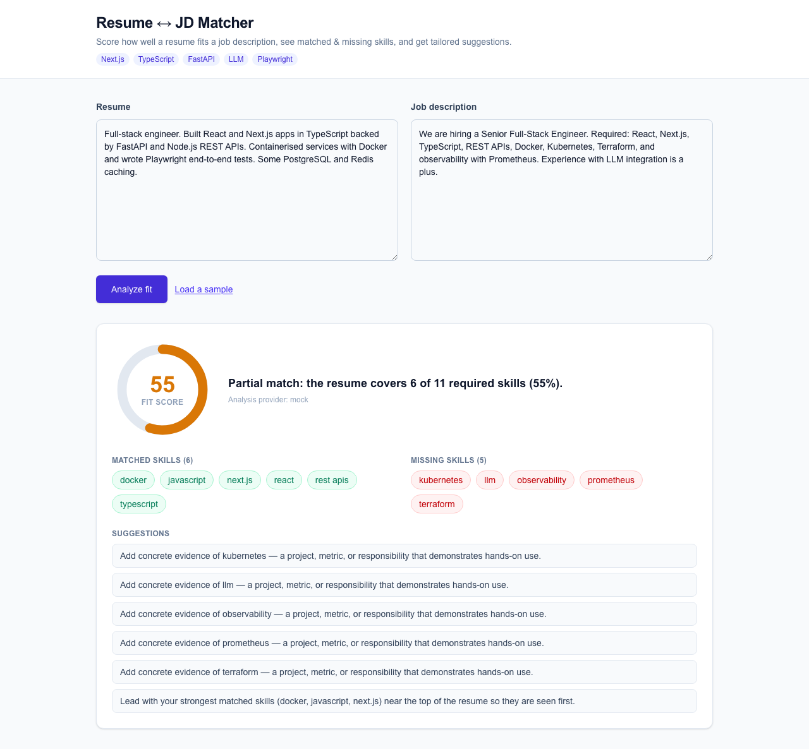

# resume-jd-matcher

[](https://github.com/Damika-Anupama/resume-jd-matcher/actions/workflows/ci.yml)

**Find out *why* a resume fails a job description — before an ATS silently rejects it.**

`resume-jd-matcher` is a transparent, deterministic engine that scores how well a resume matches a job description, lists the skills you matched, the skills you're missing, and gives concrete suggestions to close the gap. It is **not** an AI black box — the core score is reproducible skill-overlap math you can read in 50 lines of Python. An optional LLM layer adds natural-language tailoring tips on top.

---

## The problem

Job seekers spray-and-pray: they fire the same resume at 80 postings and hear nothing back. On the other side, recruiters lean on ATS keyword-matching that silently rejects a candidate the moment a required skill string isn't found — no feedback, no reason, no second look.

The result is a black hole. A qualified candidate gets auto-rejected and never learns that the JD wanted "Kubernetes" while their resume said "container orchestration." Nobody tells you **why** your resume failed a JD.

`resume-jd-matcher` closes that loop. Paste a resume and a job description and get back, in milliseconds:

- a **fit score** (0–100) you can actually explain,
- the exact skills you **matched**,
- the exact skills you're **missing**,
- and **specific suggestions** for what to add or reword.

Because the score is deterministic, the same inputs always produce the same output. You can audit it, reproduce it, and trust it.

---

## How it works

1. **Skill extraction.** Both the resume and the job description are scanned against a curated skill dictionary with aliases (e.g. `js` → `javascript`, `k8s` → `kubernetes`, `nextjs` → `next.js`). This catches the same skill written different ways.
2. **Overlap matching.** The engine computes which JD-required skills appear in the resume (`matched_skills`), which don't (`missing_skills`), and which extra skills the resume has that the JD didn't ask for (`extra_skills`).
3. **Deterministic scoring.** `fit_score = matched_required / total_required_in_JD`, scaled to 0–100. No randomness, no model weights — pure, reproducible arithmetic.
4. **Suggestions layer.** A suggestions generator produces 3–5 actionable tips ("Add concrete evidence of kubernetes…"). With no API key configured this runs through a deterministic **mock** provider so the whole app works offline at zero cost. Set `OPENROUTER_API_KEY` to upgrade the suggestions to LLM-tailored prose (OpenRouter, `gpt-4o-mini`). The `provider` field in the response tells you which path produced the output (`mock` or `openrouter`).

The transparency is the point: explainable, reproducible, offline-capable, and free by default. The LLM is an enhancement, never a dependency.

---

## Demo

Start the backend (see Install), then:

```bash
curl -s http://localhost:8000/analyze \
  -H "Content-Type: application/json" \
  -d '{
    "resume": "Built React and Next.js apps in TypeScript with FastAPI and Docker",
    "job_description": "Need React, TypeScript, Kubernetes and Terraform"
  }' | python -m json.tool
```

Response:

```json
{
  "fit_score": 50,
  "matched_skills": ["react", "typescript"],
  "missing_skills": ["kubernetes", "terraform"],
  "extra_skills": ["docker", "fastapi", "next.js"],
  "summary": "Partial match: the resume covers 2 of 4 required skills (50%).",
  "suggestions": [
    "Add concrete evidence of kubernetes — a project, metric, or responsibility that demonstrates hands-on use.",
    "Add concrete evidence of terraform — a project, metric, or responsibility that demonstrates hands-on use.",
    "Lead with your strongest matched skills (react, typescript) near the top of the resume so they are seen first."
  ],
  "provider": "mock"
}
```

> The JSON above is the **verbatim** response from the running service (mock
> provider), not a paraphrase. Two matched, two missing, score 50 — and you
> know exactly why.

---

## Install

### Backend (FastAPI)

```bash
cd backend
python -m venv .venv
source .venv/bin/activate        # Windows: .venv\Scripts\activate
pip install -r requirements.txt
uvicorn app.main:app --reload
```

The API is now live at `http://localhost:8000`. Interactive docs at `http://localhost:8000/docs`.

To enable LLM-tailored suggestions, set an OpenRouter key before launching:

```bash
export OPENROUTER_API_KEY=sk-or-...
```

Without it, the app runs fully offline using the deterministic `mock` provider.

### Frontend (Next.js)

```bash
cd frontend
npm install
npm run dev
```

Open `http://localhost:3000`, paste a resume and a JD, and see the score, matched/missing skills, and suggestions rendered in the UI.

---

## Usage

**`POST /analyze`**

Request body:

```json
{
  "resume": "string — the candidate's resume text",
  "job_description": "string — the target job description text"
}
```

Response body:

| Field | Type | Description |
|---|---|---|
| `fit_score` | `int` (0–100) | `matched_required / total_required_in_JD`, scaled |
| `matched_skills` | `string[]` | Required skills found in the resume |
| `missing_skills` | `string[]` | Required skills absent from the resume |
| `extra_skills` | `string[]` | Resume skills the JD didn't ask for |
| `summary` | `string` | One-line human summary of the match |
| `suggestions` | `string[]` | 3–5 actionable tips to improve fit |
| `provider` | `string` | `mock` (deterministic) or `openrouter` (LLM) |

Other endpoints:

- `GET /` — liveness probe (returns `{"status":"running", ...}`).
- `GET /metrics` — Prometheus metrics (request counts, latency, score distribution).

---

## Architecture

```
                 ┌─────────────────────┐
                 │   Next.js frontend   │
                 │  (paste resume + JD) │
                 └──────────┬──────────┘
                            │ POST /analyze
                            ▼
        ┌───────────────────────────────────────┐
        │            FastAPI backend             │
        │                                        │
        │  ┌──────────────────────────────────┐  │
        │  │  Deterministic matching core     │  │
        │  │  (app/matching.py)               │  │
        │  │  skill dict + aliases → overlap  │  │
        │  │  → fit_score, matched, missing   │  │
        │  └──────────────────────────────────┘  │
        │                  │                     │
        │                  ▼                     │
        │  ┌──────────────────────────────────┐  │
        │  │  Suggestions layer (optional)    │  │
        │  │  mock provider (offline) OR      │  │
        │  │  OpenRouter gpt-4o-mini          │  │
        │  └──────────────────────────────────┘  │
        │                                        │
        │  /metrics → Prometheus                 │
        └───────────────────────────────────────┘
                            │
            optional async path (decoupled)
                            ▼
        ┌───────────────────────────────────────┐
        │  Kafka events → worker → Redis store   │
        └───────────────────────────────────────┘

  Deploy: Docker images · k8s manifests · Terraform (deploy/)
```

- **Matching core** (`backend/app/matching.py`) — deterministic skill-overlap matcher. The single source of truth for the score.
- **Suggestions layer** — pluggable provider; `mock` by default, `openrouter` when a key is present.
- **Frontend** — Next.js single-page experience for paste-and-analyze.
- **Observability** — Prometheus `/metrics` endpoint plus JSON request logs with request IDs, normalized paths, status codes, and latency; logs intentionally omit resume/JD bodies.
- **Optional async path** — a Kafka event-driven analyze pipeline with a Redis shared store, for high-throughput / decoupled processing.
- **Deploy** — Dockerfiles, Kubernetes manifests, and Terraform under `deploy/`.

---

## Tech stack

| Layer | Technology |
|---|---|
| API | FastAPI (Python 3.11) |
| Matching | Pure-Python deterministic skill-overlap engine |
| LLM (optional) | OpenRouter · `gpt-4o-mini` |
| Frontend | Next.js / React / TypeScript |
| Metrics | Prometheus |
| Async (optional) | Kafka + Redis |
| Packaging | Docker |
| Orchestration | Kubernetes manifests |
| Infra-as-code | Terraform |
| Tests | pytest + custom eval harness |

---

## Tested & evaluated

This is not a weekend prototype with no safety net.

- **Unit / integration tests:** `pytest` suite — **24 passed, 2 skipped** (the 2 skips require live Kafka/Redis, which are off in local/CI without Docker).

  ```bash
  cd backend && pytest
  ```

- **Evaluation harness:** a hand-labelled set of **20 realistic resume/JD pairs** (`app/eval_dataset.py`), each annotated with the gold skills a careful human reader would extract, plus an expected fit band. The harness measures the deterministic engine against those human labels and prints concrete numbers:

  ```bash
  cd backend && python -m app.evaluate        # human-readable report
  cd backend && python -m app.evaluate --json  # machine-readable
  ```

  Latest measured results (deterministic, reproducible run-to-run):

  | Metric | Value |
  | --- | --- |
  | Skill-extraction precision | **1.00** (196 TP, 0 FP) |
  | Skill-extraction recall | **0.99** (2 FN) |
  | Skill-extraction F1 | **0.995** |
  | Fit-score mean absolute error | **0.99 pts** vs human reference (19 pairs) |
  | Fit-band classification accuracy | **1.00** (20/20) |
  | Behavioural golden set | **6/6** |

  The 2 false-negatives are a deliberately-documented limitation (bare 2-letter `Go` is not extracted to avoid false-positives on the English verb; use `Golang`). Because the score is deterministic, these numbers are stable run-to-run — you measure the engine, not model variance. The quality bars are also pinned as pytest assertions (`tests/test_eval_metrics.py`) so a regression fails CI rather than passing silently.

---

## License & honesty note

`resume-jd-matcher` is a transparent skill-overlap matcher with an **optional** LLM suggestions layer. It does not pretend to be an AI oracle. The score is reproducible arithmetic you can read, audit, and trust — and it runs fully offline at zero API cost by default.

## Screenshots

| Input | Results |
|---|---|
|  |  |
