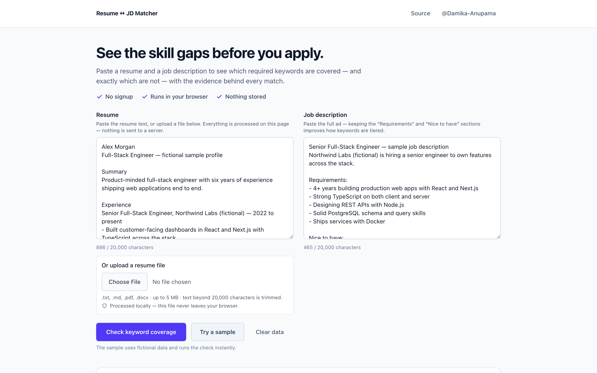
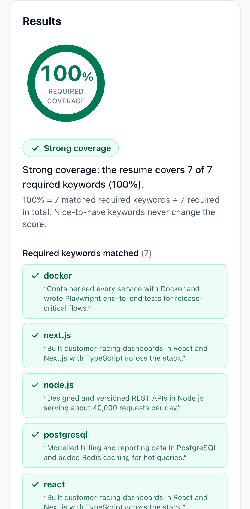

# Resume ↔ JD Keyword Coverage

[](https://github.com/Damika-Anupama/resume-jd-matcher/actions/workflows/ci.yml)

**A transparent, browser-local keyword-coverage check between a resume and a job description.**

Paste a resume and a job description; get back the share of the JD's **required
keywords** that appear in the resume, the exact keywords matched and missing
(required vs nice-to-have, listed separately), and honest suggestions for
closing real gaps. Everything runs in your browser — the text never leaves the
page.

**Live demo:** _URL pending deployment verification_

## Screenshots

| Desktop | Mobile |
|---|---|
|  |  |

*(Screenshots are captured at release; placeholders until then.)*

## What it is — and what it is NOT

**It is:**

- a deterministic **keyword-coverage** check: which recognised skill keywords
  from the JD's *required* list also appear in the resume,
- fully **explainable** — every point of the score traces to a specific
  keyword and the resume line it was found on,
- **private by default** — analysis and file parsing run entirely in the
  browser; no resume or JD byte is sent to any server, stored, or logged.

**It is NOT:**

- **an ATS simulator.** It does not reproduce how any applicant-tracking
  system scores, parses or filters resumes — real ATS behaviour varies by
  vendor and configuration, and recruiters dispute how much keyword
  auto-rejection even happens.
- **a hiring prediction.** A high score does not mean you will get an
  interview; a low score does not mean you are unqualified.
- a semantic or AI matcher. It matches a curated keyword dictionary with
  aliases (`k8s` → `kubernetes`), nothing deeper. Treat the output as a
  directional checklist, not a verdict.

## How the score works

1. Both texts are scanned against a curated skill dictionary with aliases, so
   the same skill written different ways still counts.
2. JD keywords are split into **required** and **nice-to-have** tiers from cue
   phrases in the posting ("preferred", "a plus", "bonus"…).
3. The score is **required-keyword coverage**:

   ```
   score = round(100 × |required keywords found in resume| / |required keywords in JD|)
   ```

   Nice-to-have coverage is reported separately and never affects the score.
4. Resume statements that *negate* a skill ("no Kubernetes experience",
   "eager to learn Terraform") do not count as evidence.
5. If the JD contains no recognisable required keywords, the app reports
   **insufficient signal** instead of inventing a number.

Same inputs, same output, every time — the matcher is deterministic and open
source, so you can audit exactly why each keyword was or wasn't counted.

## Privacy model

The public demo runs **local-only**:

- matching, tiering and suggestion generation execute in the browser,
- file-to-text extraction happens in the browser,
- no analytics, cookies, or storage of resume/JD content — "Clear data" wipes
  the ephemeral in-page state,
- the e2e suite enforces this: dedicated tests assert that user text never
  appears in network requests, console output, cookies, or any browser
  storage surface.

## Architecture

**Public demo (this deployment):** a Next.js static frontend. The matching
engine is a TypeScript port of the Python reference implementation, kept in
lockstep by shared contract fixtures and a sync script (`scripts/sync-skills.mjs`).

**Full product architecture (private, not part of the public demo):** the
repository also contains the backend of a fuller product — a FastAPI service
(same deterministic matcher, optional LLM suggestion layer), an optional
Kafka + Redis async pipeline, Prometheus metrics, Docker images, Kubernetes
manifests and Terraform. These are labelled honestly: they demonstrate the
service architecture but have remaining gaps before production use (no DLQ or
idempotency on the async path, no image release pipeline, no TLS/ingress
hardening, Terraform not wired to a real cloud account). See
[docs/backlog.md](docs/backlog.md) for the prioritized list.

```
Public demo:   browser ── local TypeScript matcher ── results (nothing leaves the page)

Private full product (labelled, gaps listed in docs/backlog.md):
  Next.js ── FastAPI (/v1/analyze, /v1/extract) ── deterministic matcher
                   │                                   └─ optional LLM suggestions
                   └─ optional Kafka → worker → Redis async path
  Deploy: Docker · Kubernetes manifests · Terraform · Prometheus metrics
```

## Evaluation

The Python engine is measured by an evaluation harness against a
**synthetic, hand-labelled dataset of 20 resume/JD pairs**
(`backend/app/eval_dataset.py`). Important caveats, stated up front:

- the dataset is **synthetic and self-aligned** — the pairs were written with
  the same skill taxonomy the engine uses, so the metrics measure
  **extraction agreement with the taxonomy's own labels**, not real-world
  matching quality;
- results on real resumes and postings will be worse, particularly for skills
  phrased outside the dictionary's aliases.

Within those limits the harness is still useful: it is deterministic,
reproducible run-to-run, and pinned as pytest assertions so a regression
fails CI instead of passing silently. Methodology and current numbers:
[docs/evaluation.md](docs/evaluation.md).

## Testing

- Python: pytest unit/integration suite plus the evaluation gate.
- Frontend: ESLint, `tsc --noEmit`, production build.
- E2E: Playwright on desktop and mobile Chromium — user flows, keyboard-only
  operation, axe-core accessibility scans, file-upload edge cases, and
  privacy checks (no network/storage/console leakage of user text).
- CI: least-privilege GitHub Actions pinned to commit SHAs, dependency audits
  (npm audit, pip-audit), CodeQL, Dependabot, and IaC validation
  (terraform validate, kubeconform, Checkov).

<!-- test-counts: updated at release -->

## Development

```bash
# Frontend (public demo)
cd frontend
npm ci
npm run dev          # http://localhost:3000
npm run test:e2e     # Playwright suite

# Backend (private full product)
cd backend
python -m venv .venv && source .venv/bin/activate
pip install -r requirements.txt -r requirements-dev.txt
uvicorn app.main:app --reload
pytest
```

More: [frontend/README.md](frontend/README.md), [docs/case-study.md](docs/case-study.md),
[docs/matching.md](docs/matching.md), [docs/adr/](docs/adr/).

## License

See [LICENSE](LICENSE).

---

**Need a tailored workflow like this for your business?** I build small,
honest, well-tested tools end to end — get in touch via
[github.com/Damika-Anupama](https://github.com/Damika-Anupama).
